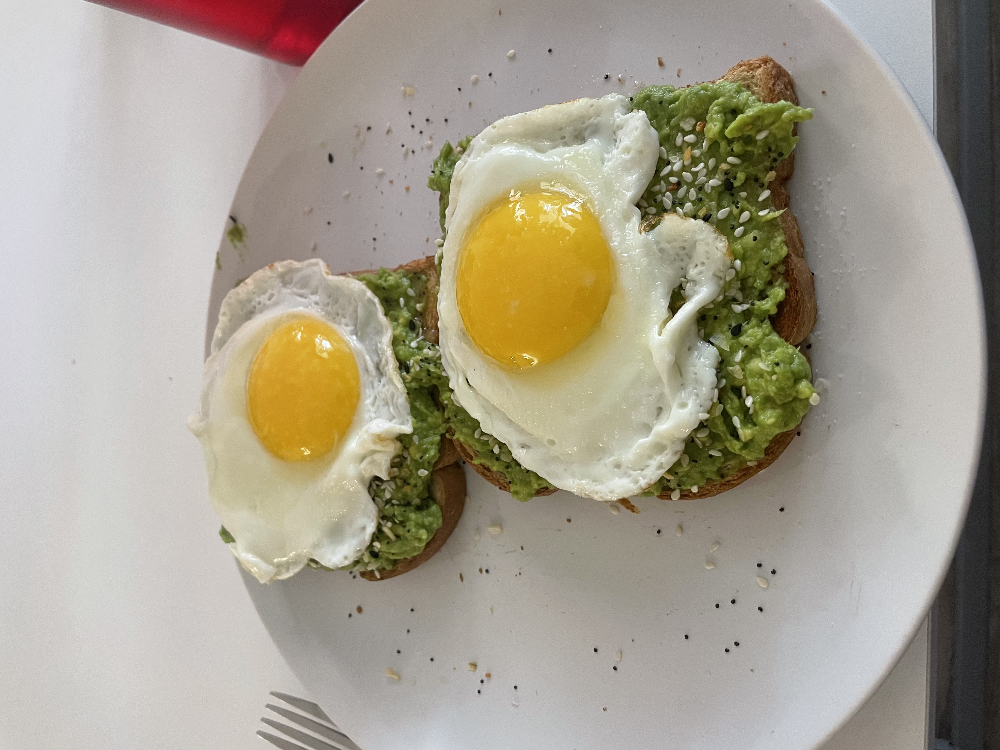
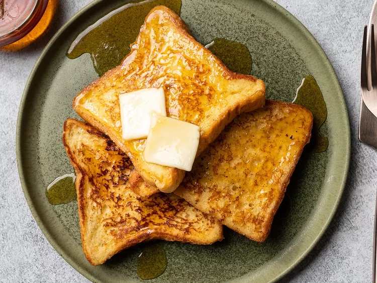

# Breakfast Recipes

## Avocado Toast w/ Egg {-}

<div class="custom-image2">
```{r i5, echo=FALSE}

```
</div>

| **PREP TIME** | **COOK TIME** | **SERVINGS** | **RATING** |
|---------------|---------------|--------------|------------|
| 5 mins        | 5 mins        | **1**        |★ ★ ★ ★ ★ |

<div class="recipe-columns">

<div class="equipment">
### Equipment {-}
- 1 mixing bowl
- 1 fork
- 1 sharp knife
- 1 skillet
- Toaster
</div>

<div class="ingredients">
### Ingredients {-}
- 1 ripe avocado [*](https://www.publix.com/pd/hass-avocados/RIO-PCI-107578?origin=search1)
- 1 lemon wedge [*](https://www.publix.com/pd/lemons/RIO-PCI-107591?origin=search1)
- Salt [*](https://www.publix.com/pd/morton-salt/RIO-PCI-103677?origin=search9)
- Pepper [*](https://www.publix.com/pd/publix-black-pepper-ground/RIO-PCI-110488?origin=search1)
- Everything bagel seasoning [*](https://www.publix.com/pd/badia-everything-bagel/RIO-PCI-572577?origin=search1)
- 2 pieces of toast [*](https://www.publix.com/pd/natures-own-honey-wheat-sandwich-bread-20-oz-loaf/RIO-PCI-144911?origin=search1)
- 2 eggs [*](https://www.publix.com/pd/publix-eggs-large/RIO-PCI-145492?origin=search8)
- 2 tbsp avocado oil [*](https://www.publix.com/pd/publix-avocado-oil/RIO-PCI-575036?origin=search1)

</div>

</div>

Click on the '*' next to each ingredient to see detailed information and resources for it.

<div class="instructions">
<p class="instruction-header">Instructions</p>

**Step 1:**
Halve the avocado vertically and remove the pit. Use a small knife to dice the avocado flesh while it's still inside the skin. Scoop the diced avocado flesh out of the skin and into a small bowl. 

**Step 2:**
Use a fork to mash the avocado until it’s as smooth as you like it. Mix in a pinch of salt and pepper (about 1/8 teaspoon each) and add more to taste, if desired. Lastly, squeeze in the lemon juice and mix thoroughly. 

**Step 3:**
Toast your slice of bread until golden and firm.

**Step 4:**
While the bread toasts cook the egg by first pouring 1 tbsp of avocado oil over low heat in a small (8-inch) non-stick skillet. Once it is hot, crack the eggs into the skillet and cook the egg until it is cooked through, about 2 to 3 minutes.

**Step 5:**
Once the toast is done, spread the avocado mash on top of each slice. Drizzle them both with avocado oil and sprinkle them with everything bagel seasoning.

**Step 6:**
Once the eggs are done, place the eggs on each of the slices and enjoy!

</div>

## French Toast {-}

<div class="custom-image2">
```{r i6, echo=FALSE}

```
</div>

| **PREP TIME** | **COOK TIME** | **SERVINGS** | **RATING** |
|---------------|---------------|--------------|------------|
| 5 mins        | 35 mins       | **4**        |★ ★ ★ ★ ☆ |

<div class="recipe-columns">

<div class="equipment">
### Equipment {-}
- 1 rimmed baking sheet
- 1 wire rack
- 1 large mixing bowl
- 1 large non-stick skillet
</div>

<div class="ingredients">
### Ingredients {-}
- 8 (1/2-inch thick) slices of white bread [*](https://www.publix.com/pd/natures-own-honey-wheat-sandwich-bread-20-oz-loaf/RIO-PCI-144911?origin=search1)
- 6 large eggs [*](https://www.publix.com/pd/publix-eggs-large/RIO-PCI-145492?origin=search8)
- 4 tbsp sugar, plus more for sprinkling [*](https://www.publix.com/pd/publix-sugar-pure-granulated-extra-fine/RIO-PCI-143101?origin=search1)
- Pinch of salt [*](https://www.publix.com/pd/morton-salt/RIO-PCI-103677?origin=search9)
- Pinch of ground cinnamon [*](https://www.publix.com/pd/publix-cinnamon-ground/RIO-PCI-111220?origin=search1)
- Pinch of freshly grated nutmeg [*](https://www.publix.com/pd/mccormick-ground-nutmeg/RIO-PCI-110645?origin=search1)
- 1/4 teaspoon vanilla extract [*](https://www.publix.com/pd/publix-vanilla-extract/RIO-PCI-110432?origin=search1)
- 2 cups whole milk [*](https://www.publix.com/pd/publix-milk-whole/RIO-PCI-120772?origin=search3)
- 4 tbsp unsalted butter for the pan [*](https://www.publix.com/pd/land-o-lakes-unsalted-butter-made-with-sweet-cream/RIO-PCI-112513?origin=search2)
- Maple syrup, for serving [*](https://www.publix.com/pd/pearl-milling-company-syrup-original/RIO-PCI-102438?origin=search10)

</div>

</div>

Click on the '*' next to each ingredient to see detailed information and resources for it.

<div class="instructions">
<p class="instruction-header">Instructions</p>

**Step 1:**
Set a wire rack on a rimmed baking sheet in the oven and preheat to 200°F (93°C). If using very fresh, moist bread, arrange slices in a single layer on the rack and cook in oven, turning once, until lightly toasted, about 10 minutes.

**Step 2:**
Meanwhile, in a large mixing bowl, whisk together eggs, sugar, salt, cinnamon, nutmeg, and vanilla until thoroughly combined. Add milk and whisk to blend.

**Step 3:**
Heat 1 tablespoon butter in a large non-stick or cast iron skillet over medium heat, swirling skillet, until foaming subsides, about 5 minutes.

**Step 4:**
Soak 2 slices of bread in egg bath, turning, until saturated. Add soaked bread to skillet and cook, swirling occasionally, until browned on bottom side, about 3 minutes. Sprinkle top side of bread with sugar, flip, and continue to cook, swirling occasionally, until browned on second side, about 3 minutes longer.

**Step 5:**
Transfer French toast to the rack in the oven in a single layer to keep warm and repeat with remaining slices of bread and egg bath.

**Step 6:**
Serve French toast with pats of butter and maple syrup.

</div>
