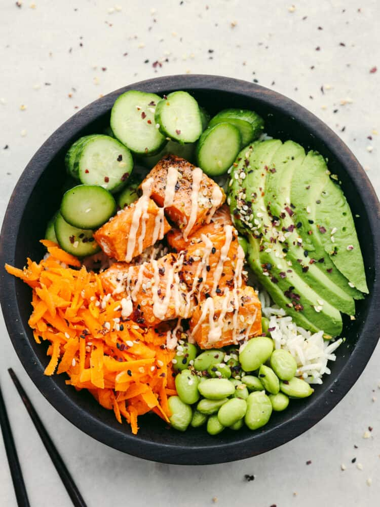
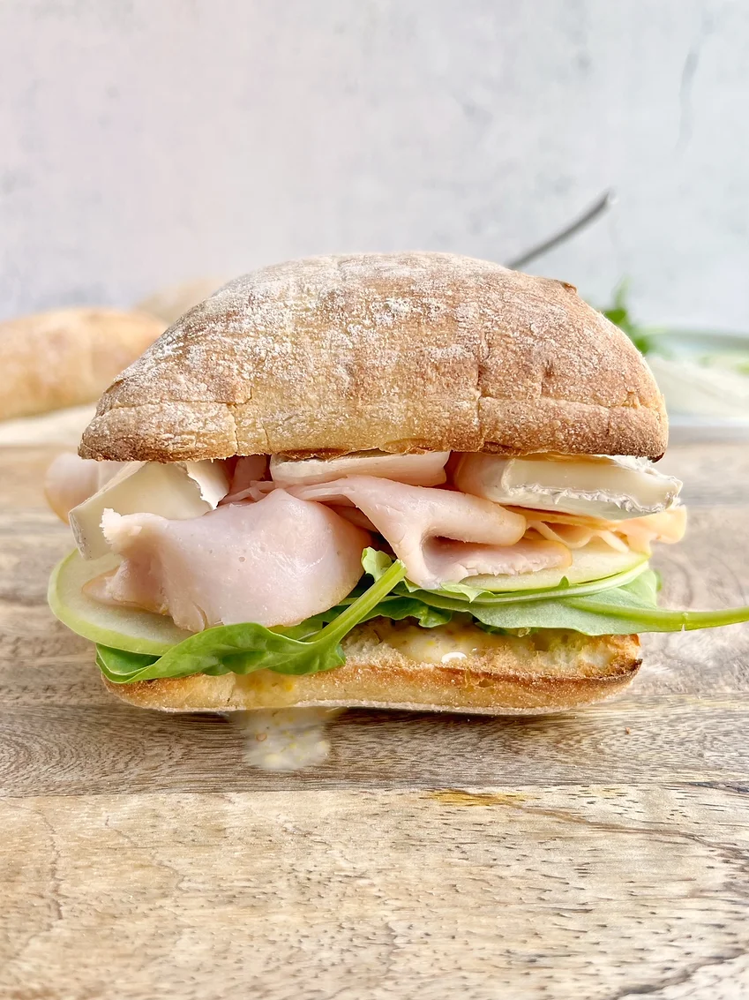

# Lunch Recipes

## Salmon Rice Bowl {-}

<div class="custom-image2">
```{r i7, echo=FALSE}

```
</div>

| **PREP TIME** | **COOK TIME** | **SERVINGS** | **RATING** |
|---------------|---------------|--------------|------------|
| 10 mins       | 30 mins       | **1**        |★ ★ ★ ★ ★ |

<div class="recipe-columns">

<div class="equipment">
### Equipment {-}
- 1 large cooking pot
- 1 airfryer or large skillet
- 1 sharp knife
- 1 rubber spatula
- 1 cutting board
- 2 small mixing bowls
</div>

<div class="ingredients">
### Ingredients {-}
- 1 cup of jasmine rice [*](https://www.publix.com/pd/publix-rice-jasmine/RIO-PCI-142398?origin=search1)
- 1 1/4 cups water (cold tap water) 
- 4 ounces salmon filet [*](https://www.publix.com/pd/salmon-select-cuts-fresh-responsibly-sourced-farmed/RIO-FNU-591951?origin=search2)
- 1/2 tsp of salt [*](https://www.publix.com/pd/morton-salt/RIO-PCI-103677?origin=search9)
- 1/4 tsp of pepper [*](https://www.publix.com/pd/publix-black-pepper-ground/RIO-PCI-110488?origin=search1)
- 1/4 tsp onion powder [*](https://www.publix.com/pd/publix-onion-powder/RIO-PCI-111136?origin=search1)
- 1/2 avocado (sliced or diced) [*](https://www.publix.com/pd/hass-avocados/RIO-PCI-107578?origin=search1)
- 1/4 carrots (shredded) [*](https://www.publix.com/pd/greenwise-shredded-carrots-organic/RIO-PCI-107793?origin=search1)
- 1/4 cup Edamame (cooked) [*](https://www.publix.com/pd/seapoint-farms-edamame/RIO-PCI-159631?origin=search1)
- 1 tbsp soy sauce [*](https://www.publix.com/pd/publix-sauce-soy-less-sodium/RIO-PCI-125220?origin=search1)
- 4 tsp Sriracha mayo [*](https://www.publix.com/pd/lee-kum-kee-dressingspread-mayo-sriracha/RIO-PCI-520244?origin=search4)
- Sesame Seeds [*](https://www.publix.com/pd/badia-sesame-seeds-tri-color-organic/RIO-PCI-543666?origin=search3)

</div>

</div>

Click on the '*' next to each ingredient to see detailed information and resources for it.

<div class="instructions">
<p class="instruction-header">Instructions</p>

**Step 1:**
Place rice and water in a medium saucepan (one with a tight fitting lid). Bring to rapid simmer with NO LID on medium high.

**Step 2:**
Turn down to low or medium low so it's simmering gently, then place lid on. Do not lift lid during cook.

**Step 3:**
Cook 12 minutes or until water is absorbed by rice - tilt pot to check (if lid not glass, then QUICKLY lift lid to check)

**Step 4:**
Keep the lid on then remove from heat. Stand 10 minutes, then fluff with rubber spatula or rice paddle.

**Step 5:**
Preheat the air fryer to 390 degrees Farhenheit. Remove the skin from the salmon filets and cut the salmon into 1 inch cubes.

**Step 6:**
Place the cubed salmon in a bowl and season with salt, pepper, and onion powder.

**Step 7:**
Place the salmon in the air fryer basket in a single layer and cook for 6-8 minutes, or until the internal temperature has reached 125 degrees Fahrenheit. Feel free to pan fry over medium-high heat in a skillet for the same amount of time if you prefer.

**Step 8:**
Place the cooked rice in the bowl first. Layer on the cooked salmon, avocado, cucumber, and edamame.

**Step 9:**
Drizzle on the soy sauce, Sriracha mayo, and garnish with sesame seeds.

</div>

## Turkey Sandwich {-}

<div class="custom-image2">
```{r i8, echo=FALSE}

```
</div>

| **PREP TIME** | **COOK TIME** | **SERVINGS** | **RATING** |
|---------------|---------------|--------------|------------|
| 5 mins        | 7 mins        | **1**        |★ ★ ★ ★ ★ |

<div class="recipe-columns">

<div class="equipment">
### Equipment {-}
- 1 airfryer
- 1 sharp knife
</div>

<div class="ingredients">
### Ingredients {-}
- 1 ciabatta bread [*](https://www.publix.com/pd/presliced-ciabatta-rolls-4-count/RIO-PCI-282539?origin=search1)
- 2 tbsp of mayonnaise [*](https://www.publix.com/pd/hellmanns-real-mayonnaise-real-mayo-squeeze-bottle/RIO-PCI-509942?origin=search2)
- 1 half of an avocado [*](https://www.publix.com/pd/hass-avocados/RIO-PCI-107578?origin=search1)
- 1/2 cup of shredded lettuce [*](https://www.publix.com/pd/fresh-express-garden-salad-shreds-iceberg/RIO-PCI-107853?origin=search1)
- 2 slices of provolone cheese [*](https://www.publix.com/pd/publix-not-smoked-provolone-cheese-slices/RIO-PCI-136662?origin=search3)
- 2 tbsp olive oil [*](https://www.publix.com/pd/publix-olive-oil-extra-virgin/RIO-PCI-103897?origin=search1)
- 3 slices of Boar's Head Ovengold Roasted Turkey [*](https://www.publix.com/pd/boars-head-ovengold-roasted-turkey-breast/RIO-DSM-100234?origin=search1)

</div>

</div>

Click on the '*' next to each ingredient to see detailed information and resources for it.

<div class="instructions">
<p class="instruction-header">Instructions</p>

**Step 1:**
Slice the ciabatta bread in half. Drizzle the olive oil evenly on both slices.

**Step 2:**
Preheat the air fryer to 350 degrees Farhenheit. Once heated, place both slices in the air fryer basket in a single layer and cook for 5 minutes. 

**Step 3:**
Remove the slices from the air fryer once the 5 minutes are up. Spread the mayonnaise evenly on both slices. 

**Step 4:**
Assemble the sandwich: Layer each half of the bread with one slice of provolone cheese. On the bottom half, place the three slices of turkey evenly. Then top the turkey with the shredded lettuce and the sliced avocado. Close the sandwiches with the top roll, and enjoy.

</div>
