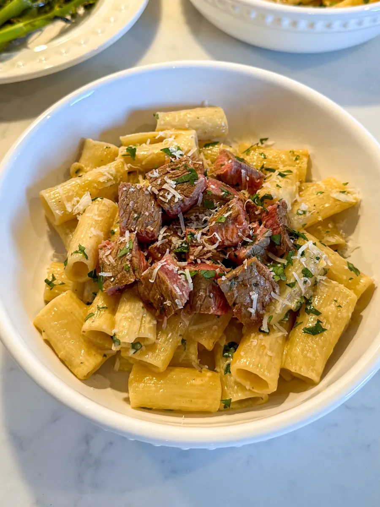
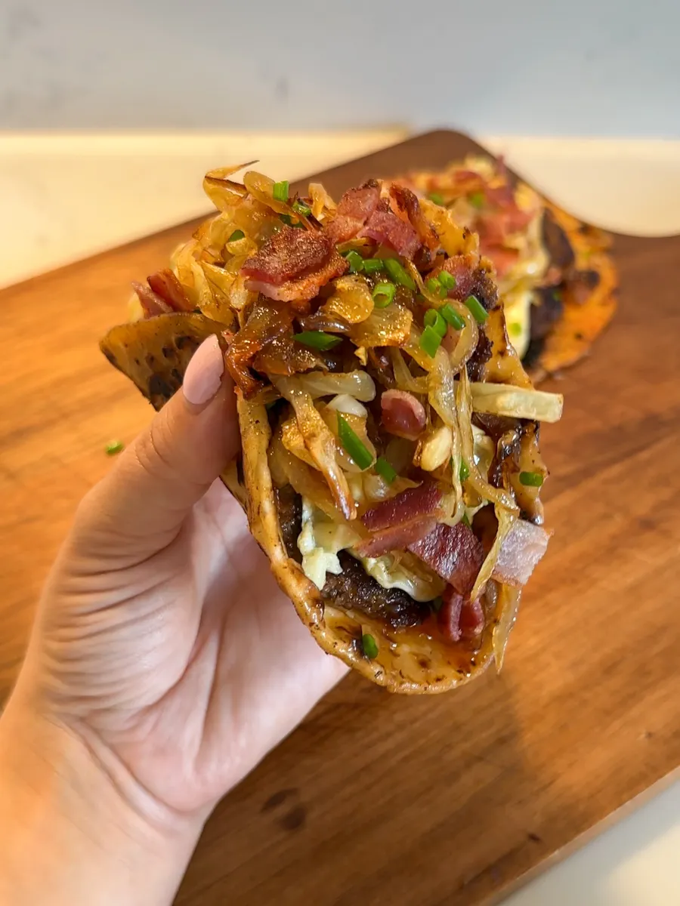

# Dinner Recipes

## Garlic Parmesan Steak Pasta {-}

<div class="custom-image2">
```{r i1, echo=FALSE}

```
</div>

| **PREP TIME** | **COOK TIME** | **SERVINGS** | **RATING** |
|---------------|---------------|--------------|------------|
| 5 mins        | 20 mins       | **4**        |★ ★ ★ ★ ★ |

<div class="recipe-columns">

<div class="equipment">
### Equipment {-}
- 2 cutting boards
- 1 frying pan
- 1 sharp knife
- 1 large pot
</div>

<div class="ingredients">
### Ingredients {-}
- 450 g Ribeye Steak (approx. 2 steaks) [*](https://www.publix.com/pd/ribeye-steaks-boneless-thin-sliced-publix-usda-choice-beef/RIO-PCI-119976?origin=search3)
- 1 tbsp paprika [*](https://www.publix.com/pd/publix-paprika-ground/RIO-PCI-123196?origin=search1)
- 2 tbsp olive oil [*](https://www.publix.com/pd/publix-olive-oil-extra-virgin/RIO-PCI-103897?origin=search1)
- 2 tsp dried parsley [*](https://www.publix.com/pd/publix-parsley-flakes/RIO-PCI-111166?origin=search1)
- Salt [*](https://www.publix.com/pd/morton-salt/RIO-PCI-103677?origin=search9)
- Pepper [*](https://www.publix.com/pd/publix-black-pepper-ground/RIO-PCI-110488?origin=search1)
- 1 onion [*](https://www.publix.com/pd/white-onions-jumbo/RIO-PCI-107142?origin=search3)
- 3 cloves of garlic [*](https://www.publix.com/pd/garlic/RIO-PCI-107127?origin=search1)
- 2 tbsp butter [*](https://www.publix.com/pd/land-o-lakes-salted-butter-sticks/RIO-PCI-112640?origin=search2)
- 1/2 cup chicken stock [*](https://www.publix.com/pd/swanson-unsalted-chicken-stock/RIO-PCI-134444?origin=search1)
- 1/2 cup double cream [*](https://www.publix.com/pd/devon-cream-double-cream-english/RIO-PCI-114706?origin=search1)
- 1/2 cup Parmesan cheese [*](https://www.publix.com/pd/publix-parmesan-fancy-shredded-cheese/RIO-PCI-132616?origin=search6)
- 1/3 cup fresh parsley [*](https://www.publix.com/pd/thats-tasty-italian-parsley/RIO-PCI-574065?origin=search4)
- 300 g Rigatoni pasta [*](https://www.publix.com/pd/ronzoni-rigatoni-pasta-16-oz-large-ribbed-tubes-non-gmo/RIO-PCI-100730?origin=search4)
</div>

</div>

Click on the '*' next to each ingredient to see detailed information and resources for it.

<div class="instructions">
<p class="instruction-header">Instructions</p>
**Step 1:**
Start by generously seasoning both sides of the ribeye steaks with paprika, dried parsley, salt, and pepper. Drizzle with olive oil and rub the seasonings into the meat to ensure even coverage. Set aside to allow the flavors to penetrate the steak.

**Step 2:**
While the steaks rest, finely dice the onion, mince the garlic cloves, finely chop the fresh parsley, and grate the Parmesan cheese.

**Step 3:**
Heat a frying pan over high heat for about 1 minute to ensure it’s hot enough to sear the steaks properly.

**Step 4:**
Place the steak on the frying pan and fry on high heat for 1 minute until browned, flip over and fry for 1 minute on the other side then add 1 tablespoon butter, spoon the butter over the steak for a further minute then set aside to rest.

**Step 5:**
Add 1 tablespoon of butter to the pan and spoon the melted butter over the steaks for an additional minute.

**Step 6:**
Remove the steaks from the pan and set them aside to rest (cooking times may vary depending on pan and type of cooker as well as how pink you like your steak).

**Step 7:**
Once the steaks have been set aside, bring the pasta to the boil by adding table salt to a pot of boiling water. Once the pot of water is boiling, add in the pasta and continue to boil.

**Step 8:**
While the pasta is cooking, begin making the sauce in the same pan the steaks were cooked in. Add more butter along with an onion and fry for 5 minutes, i also like to add a little more paprika at this point but this is optional. Add the garlic and fry for a further minute.

**Step 9:**
While the pasta is cooking, begin making the sauce in the same pan the steaks were cooked in. Add more butter along with an onion and fry for 5 minutes, i also like to add a little more paprika at this point but this is optional. Add the garlic and fry for a further minute.

**Step 10:**
Add the chicken stock and double cream to the mixture and cook on medium-high heat for 2-3 minutes before adding the Parmesan and stirring together, reduce to a simmer. Add pasta water as desired to loosen the sauce.

**Step 11:**
Add in the pasta and chopped parsley, stirring to combine before cutting the steaks in to cubes to be placed on top of each serving of pasta.
</div>

## Brie&Bacon Smash Burger Tacos {-}

<div class="custom-image2">
```{r i2, echo=FALSE}

```
</div>

| **PREP TIME** | **COOK TIME** | **SERVINGS** | **RATING** |
|---------------|---------------|--------------|------------|
| 10 mins       | 35 mins       | **4**        |★ ★ ★ ★ ☆ |

<div class="recipe-columns">

<div class="equipment">
### Equipment {-}
- 1 large skillet
- 1 large mixing bowl
- 1 spatula
- Paper towels
</div>

<div class="ingredients">
### Ingredients {-}
- 500 g beef mince [*](https://www.publix.com/pd/lean-ground-beef-burgers-7-fat-publix-beef-usda-inspected/RIO-PCI-117504?origin=search13)
- 8 mini tortillas [*](https://www.publix.com/pd/mission-flour-tortillas-street-tacos/RIO-PCI-563292?origin=search12)
- 1 tbsp paprika [*](https://www.publix.com/pd/publix-paprika-ground/RIO-PCI-123196?origin=search1)
- 1 tsp onion powder [*](https://www.publix.com/pd/publix-onion-powder/RIO-PCI-111136?origin=search1)
- 1 tsp thyme [*](https://www.publix.com/pd/thats-tasty-thyme/RIO-PCI-574066?origin=search2)
- 1 tbsp olive oil [*](https://www.publix.com/pd/publix-olive-oil-extra-virgin/RIO-PCI-103897?origin=search1)
- Salt [*](https://www.publix.com/pd/morton-salt/RIO-PCI-103677?origin=search9)
- Pepper [*](https://www.publix.com/pd/publix-black-pepper-ground/RIO-PCI-110488?origin=search1)
- 4 bacon rashers [*](https://www.publix.com/pd/hormel-black-label-bacon-original/RIO-PCI-117322?origin=search3)
- 2 onions [*](https://www.publix.com/pd/white-onions-jumbo/RIO-PCI-107142?origin=search3)
- 250 g Brie sliced [*](https://www.publix.com/pd/publix-deli-brie-cheese-imported-round/RIO-PCI-174121?origin=search5)
- 1 tbsp butter [*](https://www.publix.com/pd/land-o-lakes-salted-butter-sticks/RIO-PCI-112640?origin=search2)
- 2 tsp sugar [*](https://www.publix.com/pd/publix-sugar-pure-granulated-extra-fine/RIO-PCI-143101?origin=search1)
- 1 tbsp chopped chives [*](https://www.publix.com/pd/thats-tasty-chives/RIO-PCI-574073?origin=search2)
</div>

</div>

Click on the '*' next to each ingredient to see detailed information and resources for it.

<div class="instructions">
<p class="instruction-header">Instructions</p>
**Step 1:**
Start by preparing the onions. Thinly slice them by cutting off the tops and bottoms, then halving them and slicing thinly from right to left.

**Step 2:**
In a pan, melt some butter and add the onions along with a bit of sugar. Let them cook on low heat for 25-30 minutes, stirring occasionally.

**Step 3:**
While the onions are caramelizing, cook the bacon. Heat a large frying pan with a little oil and cook the bacon rashers until they’re crispy, about 3-4 minutes per side. Once done, set them aside to cool.

**Step 4:**
In a mixing bowl, combine the beef mince with paprika, onion granules, and dried thyme. Divide the seasoned beef into 8 equal balls.

**Step 5:**
Take each ball of beef and place it on a mini tortilla. Using your fingers, press the beef down until it evenly covers the tortilla.

**Step 6:**
Heat a lightly greased skillet over medium heat. Place 1-2 tortillas, beef side down, onto the pan and cook for about 4 minutes, allowing the beef to brown and crisp up.

**Step 7:**
Turn the heat down to medium and flip the tortillas over with a spatula, taking care to lift and wipe any excess grease from the pan with a paper towel to keep the tortilla from becoming soggy.

**Step 8:**
Once flipped, add slices of Brie cheese on top of each smash burger. Pour a little water into the pan and cover it with a lid to steam the Brie for about 2 minutes.

**Step 9:**
Remove the smash burger tacos from the skillet and place them on a paper towel or a board to soak up any remaining grease. Top each one with a generous helping of caramelized onions, crispy bacon pieces, and a sprinkle of chopped chives.

</div>