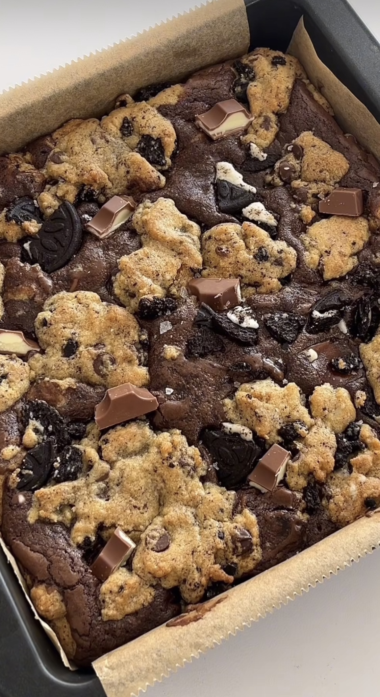
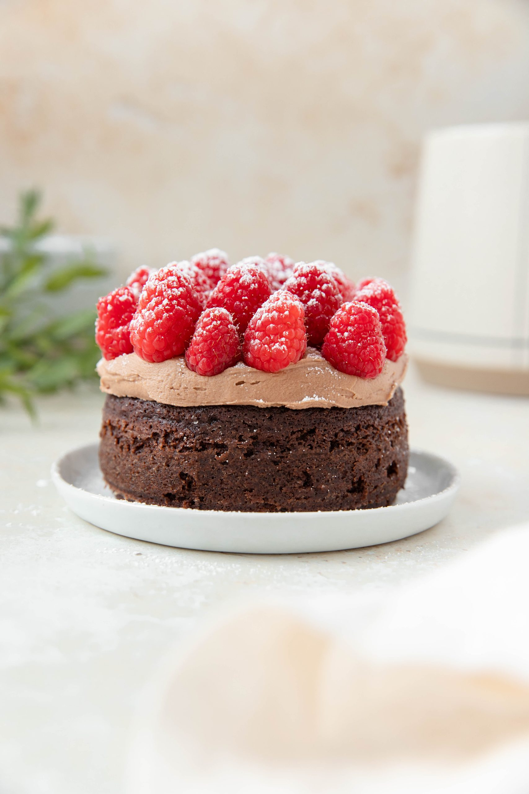

# Dessert Recipes

## Loaded Brookie {-}

<div class="custom-image2">
```{r i3, echo=FALSE}

```
</div>

| **PREP TIME** | **COOK TIME** | **SERVINGS** | **RATING** |
|---------------|---------------|--------------|------------|
| 15 mins       | 45 mins       | **12**       |★ ★ ★ ★ ★ |

<div class="recipe-columns">

<div class="equipment">
### Equipment {-}
- 2 mixing bowls
- 2 whisks
- 1 sifter
- 1 square baking tin
- Aluminum foil
- Parchment paper
</div>

<div class="ingredients">
### Ingredients {-}
<p>Brownie Batter:</p>
- 100 g dark chocolate [*](https://www.publix.com/pd/lilys-baking-chips-dark-chocolate/RIO-PCI-541806?origin=search8)
- 100 g unsalted butter [*](https://www.publix.com/pd/land-o-lakes-unsalted-butter-made-with-sweet-cream/RIO-PCI-112513?origin=search2)
- 2 medium eggs [*](https://www.publix.com/pd/publix-eggs-large/RIO-PCI-145492?origin=search8)
- 140 g caster sugar [*](https://www.publix.com/pd/publix-sugar-pure-granulated-extra-fine/RIO-PCI-143101?origin=search1)
- 50 g plain flour [*](https://www.publix.com/pd/publix-all-purpose-flour/RIO-PCI-104014?origin=search1)
- 25 g cocoa powder [*](https://www.publix.com/pd/hersheys-dutched-cocoa-special-dark/RIO-PCI-102330?origin=search1)
- 100 g Kinder chocolate [*](https://www.publix.com/pd/kinder-chocolate/RIO-PCI-613809?origin=search1)

<p>Cookie Dough:</p>
- 115 g unsalted butter [*](https://www.publix.com/pd/land-o-lakes-unsalted-butter-made-with-sweet-cream/RIO-PCI-112513?origin=search2)
- 125 g light brown sugar [*](https://www.publix.com/pd/publix-sugar-light-brown/RIO-PCI-128825?origin=search1)
- 1 medium egg [*](https://www.publix.com/pd/publix-eggs-large/RIO-PCI-145492?origin=search8)
- 1/2 tsp vanilla extract [*](https://www.publix.com/pd/publix-vanilla-extract/RIO-PCI-110432?origin=search1)
- 225 g plain flour [*](https://www.publix.com/pd/publix-all-purpose-flour/RIO-PCI-104014?origin=search1)
- 1/2 tsp bicarbonate of soda [*](https://www.publix.com/pd/arm-and-hammer-baking-soda-pure/RIO-PCI-102907?origin=search1)
- 1/2 tsp salt [*](https://www.publix.com/pd/morton-salt/RIO-PCI-103677?origin=search9)
- 1 tbsp cornflour [*](https://www.publix.com/pd/argo-corn-starch/RIO-PCI-102788?origin=search7)
- 80 g dark chocolate chips [*](https://www.publix.com/pd/lilys-baking-chips-dark-chocolate/RIO-PCI-541806?origin=search8)
- 5 crushed Oreos [*](https://www.publix.com/pd/oreo-double-stuf-chocolate-sandwich-cookies-1403-oz/RIO-PCI-145118?origin=search4)
</div>

</div>

Click on the '*' next to each ingredient to see detailed information and resources for it.

<div class="instructions">
<p class="instruction-header">Instructions</p>

*To make the brownie batter:* <br>
**Step 1:**
Melt together your dark chocolate with your butter until smooth.

**Step 2:**
Whisk together the eggs and sugar into a thick mousse like mixture, and then told through the melted chocolate mix.

**Step 3:**
Sift in the flour, and cocoa powder, and fold through again.

**Step 4:**
Mix through Kinder chocolate, save a handful for the end, and set aside.

*To make the cookie dough:* <br>
**Step 5:**
Beat together your butter and sugar until light and fluffy.

**Step 6:**
Add in the egg, and vanilla, and beat again until smooth.

**Step 7:**
Add in the flour, bicarbonate, salt and cornflour and beat until a cookie dough is formed!

**Step 8:**
Mix through the chocolate chips and Oreos. You are ready to assemble!

*Now combine:* <br>
**Step 9:**
In a lined square baking tin, spoon in half of the brownie batter and half of the cookie dough. Crush some extra Oreos on top before adding the remaining batter and dough on top.

**Step 10:**
Bake at 160°C covered with foil for 20 mins. Remove the foil and bake for an additional 15 minutes. Whilst cooling top with extra Kinder chocolate and flaky sea salt.

</div>


## Mini Chocolate Cake {-}

<div class="custom-image2">
```{r i4, echo=FALSE}

```
</div>

| **PREP TIME** | **COOK TIME** | **SERVINGS** | **RATING** |
|---------------|---------------|--------------|------------|
| 15 mins       | 15-20 mins    | **1-2**      |★ ★ ★ ★ ★ |

<div class="recipe-columns">

<div class="equipment">
### Equipment {-}
- 1 4 inch pan
- 3 small bowls
- 1 medium bowl
- 1 hand or stand mixer
- 3 whisks
- Cooking spray
- Frosting knife
</div>

<div class="ingredients">
### Ingredients {-}
<p>Chocolate Cake:</p>
- 1/4 cup flour [*](https://www.publix.com/pd/publix-all-purpose-flour/RIO-PCI-104014?origin=search1)
- 2 tbsp cocoa powder [*](https://www.publix.com/pd/hersheys-dutched-cocoa-special-dark/RIO-PCI-102330?origin=search1)
- 1/8 tsp baking soda [*](https://www.publix.com/pd/arm-and-hammer-baking-soda-pure/RIO-PCI-102907?origin=search1)
- 1/8 tsp baking powder [*](https://www.publix.com/pd/rumford-baking-powder/RIO-PCI-102919?origin=search1)
- 1/8 tsp salt [*](https://www.publix.com/pd/morton-salt/RIO-PCI-103677?origin=search9)
- 1/4 cup milk [*](https://www.publix.com/pd/publix-milk-whole/RIO-PCI-120772?origin=search3)
- 1/2 tsp vinegar (white or apple cider) [*](https://www.publix.com/pd/publix-vinegar-white-distilled/RIO-PCI-105146?origin=search3)
- 2 tbsp olive oil [*](https://www.publix.com/pd/publix-olive-oil-extra-virgin/RIO-PCI-103897?origin=search1)
- 3 tbsp sugar [*](https://www.publix.com/pd/publix-sugar-pure-granulated-extra-fine/RIO-PCI-143101?origin=search1)
- 1/2 tsp vanilla extract [*](https://www.publix.com/pd/publix-vanilla-extract/RIO-PCI-110432?origin=search1)
- 1 tsp hot water

<p>Chocolate Frosting:</p>
- 3 tbsp butter (slightly softened) [*](https://www.publix.com/pd/land-o-lakes-unsalted-butter-made-with-sweet-cream/RIO-PCI-112513?origin=search2)
- 3/4 cup powdered sugar [*](https://www.publix.com/pd/publix-powdered-sugar-confectioners/RIO-PCI-127078?origin=search1)
- 2 tsp cocoa powder [*](https://www.publix.com/pd/hersheys-dutched-cocoa-special-dark/RIO-PCI-102330?origin=search1)
- splash of vanilla extract [*](https://www.publix.com/pd/publix-vanilla-extract/RIO-PCI-110432?origin=search1)
- 1/2-1 tsp milk [*](https://www.publix.com/pd/publix-milk-whole/RIO-PCI-120772?origin=search3)

<p>Chocolate Frosting:</p>
- 15-20 fresh raspberries [*](https://www.publix.com/pd/red-raspberries/RIO-PCI-107475?origin=search1)
- powdered sugar [*](https://www.publix.com/pd/publix-powdered-sugar-confectioners/RIO-PCI-127078?origin=search1)
</div>

</div>

Click on the '*' next to each ingredient to see detailed information and resources for it.

<div class="instructions">
<p class="instruction-header">Instructions</p>

**Step 1:**
Preheat the oven to 350F. Grease and flour a 4 inch pan or ramekin (or any 4 inch pan/cup that is oven safe).

**Step 2:**
In a small bowl, combine the flour, cocoa powder, baking soda, baking powder, and salt. In another small bowl, combine the milk and vinegar. Stir and let it sit for a couple minutes. 

**Step 3:**
While it sits, combine the oil, sugar, and vanilla in a small bowl. Add the milk/vinegar to the wet ingredients and stir.

**Step 4:**
Pour the dry ingredients into the wet, then gently stir to combine. Add the hot water and stir again. 

**Step 5:**
Pour batter into greased pan, then bake in the oven for 15-20 minutes, until an inserted toothpick comes out clean.

**Step 6:**
While the cake cools, make the frosting. Add the butter, powdered sugar, and cocoa powder to a medium bowl. Use a hand mixer (or stand mixer) and mix together for 2 minutes. Add vanilla and milk and mix again. If you want a thinner frosting, add more milk.

**Step 7:**
When the cake is completely cooled, add the frosting on top. Top with raspberries, placing them upside down. Finish with a dusting of powdered sugar. Enjoy!

</div>